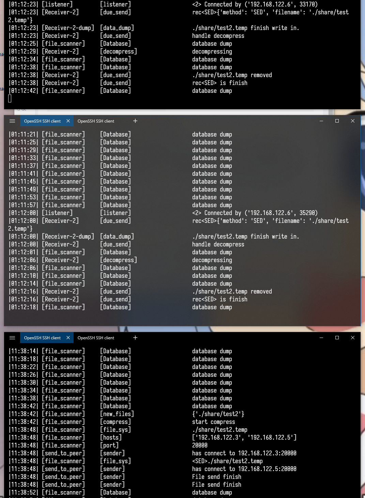

<!--  -->

_本repo能给各位学弟学妹提供作业思路我非常开心，但是请注意，不要抄代码也不要卖代码，因为此repo已提交给学校的查重库，也已经提交给TA与教授。认真完成这个作业对代码能力是有很大提升的。有问题可以联系我：aruix@teaforence.com 。_


<h1> <center>Large Efficient Flexible and Trusty (LEFT) Files Sharing Report


## 1. Abstract 

The main purpose of this coursework is to synchronize large files with each other. Encryption and compression are used in the transfer process to make it faster and more secure. Breakpoint transfer and modification retransmission are also used to make the project more complete and flexible. The application layer protocol is based on TCP for transmission.

## 2. Introduction

### 2.1 Project requirement  

The coursework requirements are as follows:

1. all files or folders in the `./share` folder can be synchronized to the `peer`, after `peer`'s `ip` address is entered in the `main` function. Regardless of when the `peer` comes online and when the new files appear.
2. During the transfer, if the file peer is down for any reason, after it comes online, the file can continue to be transferred according to the progress until the transfer is completed.
3. After a file has been modified, the modified file can be transferred to the `peer`, so that the file remains consistent.
5. When opening this application, if there is a `-encryption yes` option in the parameters, the whole process will be transferred using encryption.
5. All files transferred should be complete and error-free.

### 2.2 Background

In the information age scenario, people's data is frequently used in multiple devices. So in this case, an application for data synchronization is very necessary. Products like `iCloud`, `one drive`, `drop box`, `google cloud` etc. were made by major companies when they found this scenario. This proves the importance of data synchronization in the information age. File synchronization tools have been developed since the 90's [1]. Later the algorithm of data synchronization was improved again to reduce the transmission delay and improve the reliability [2] [3].


I designed the entire application layer transport protocol transport protocol, designed the entire application synchronization protocol, wrote the entire project code, and wrote this coursework report.

## 3. Methodology 

### 3.1 Proposed protocol

This is the idea of application procedure.

.png)

#### 3.1.1 Package

This is the package like:

```
package: 
 
|--8Bytes-|
+----+----+-----------+-----------------------------------------+
|1234|5678|   header  |                   body                  |
+----+----+-----------+-----------------------------------------+
|    |
|    +body_length
+header_length
```

The header and body sections are not necessarily long, so as to provide better expandability and flexibility for future system upgrades. And Use first 8 bytes to divide a message.

1. 1 to 4 bytes is `header length`, which is used to record the length of `header`. 
2. 5 to 8 bytes is `body length`, which is used to record the length of `body`.
3. header holds meta information about this type of `message`.
4. body is the payload of `message`.

#### 3.1.2 Header

The following table is used to display all the fields in the header: 


```
header fields:

(* is must)
1. *methods
2. filename
3. start index
```

The `header` contains the `method` field of the `message`, the `filename` field and the `start index` field for modification and retransmission. In order to make the system extensible and portable, the `header` of the `package` is transferred using `json`. This makes it possible to add new fields to the `header` and to make the `header` logical hierarchy deeper.

In the case of different `method`, different header fields are needed to match the functionality of that type of `message`. 


```table
transfer protocol all methods in header

+------+--------+-------------------------------------------------------+
|  \   | method |                   description                         |
+------+--------+-------------------------------------------------------+
|  1   |   REQ  |  send request message to get messing file             |
|  2   |   SED  |  send send message to send a whole file               |
|  3   |   UPT  |  send update message to send a part of whole file     |
|  4   |   DEL  |  send delete message to delete all files in the list  |
+------+--------+-------------------------------------------------------+
```

The `body` needs to be loaded with different `payload`s for different `message`s in different headers.


The following table shows the meaning of the different fields in the case of different types of `method`, whether they are required or not, and the type of `payload` message in `body`.


| **Methods** | **Filename**                     | Start_index                                               | Body                                                         |
| ----------- | -------------------------------- | --------------------------------------------------------- | ------------------------------------------------------------ |
| **request** | The name of need to resent files | Resent start index                                        | -                                                            |
| **send**    | The name of need to sent files   | -                                                         | A whole file                                                 |
| **update**  | The name of need to update files | Update data start index(in this coursework, default is 0) | The modified file information is read from the start position. |
| **delete**  | -                                | -                                                         | List of file names to be deleted                             |

#### 3.1.3 Proposed functions and ideas

1. I don't think files should be transferred in small chunks. This would cause waste of header information, waste of network bandwidth, and unnecessary trouble when writing code. In the process of sending a complete file, I use to transfer the metadata of the file in the `header` and the payload (all the contents of the file) in the `body`. 
2. Use `compress` when the file is larger than `500M`, because for small files, the compression process may take longer than the transfer.
3. When receiving, first add the file name to the `transfering_set` of the `database`, and these file names will be persisted when stopped to be used as the `<REQ> message` for the next retransmission, and then add The size of the current file on the above is used as `start_index`.

## 4. Implementation 

### 4.1 Steps of implementation

My steps to implement this coursework are following steps:

1. Clarify the requirements of coursework.
2. Start dividing the corresponding function into modules, and write the function name and the function of this function.
3. Improve functional modules. The functions that can be put together form a class, and objects are used to perform functions.
4. Form functions that can be reused in function modules, and try to make each function only do one thing.
5. Clear the context of the functional modules, and start writing multi-thread and multi-process.
6. Test and debug.

### 4.2 Programming skills

Object-oriented programming, modular and multithreading are used in this coursework.

#### 4.2.1 Object-Oriented Programming

1. `database` is regarded as a singleton object. For thread safety, a mutex lock is used for write protection when writing.
2. The transmission data package `package` uses the object `Package` for packaging, automatically adding `header_length` and `body_length.`
3. All files that need to be synchronized are abstracted into `SyncFile` objects, and `mtime` and `size` are automatically obtained.

#### 4.2.2 Multithreading

1. Every time a request is received by `listener`, a `receiver` sub-thread is opened for data reception.
2. When the `receiver` receives data, open the `data_dump` thread to write the received data to the file.
3. When starting the program, `file_sys` will be opened to continuously detect file changes.

#### 4.2.3 Modular

1. Functions related to `IO` operations are placed in `asysio.py`
2. Code related file systems are placed in `asysfs.py`
3. Code about `socket send` is in `asystp.py`
4. Code about processing requests and sending information is in `aserver.py`
5. Code about data storage is in `db.json`
6. The configuration information about system configuration is in `config.json`
7. The code for the operation of the entire system is in `asys.py`
8. `main.py` is used to schedule multiple threads and the order of functions

## 5. Testing and results 

###  5.1 Testing environment

`tinycore linux` in `Virtual box` in `Windows 10`


Linux system version

```shell
tc@box:~$ cat /proc/version
Linux version 5.4.3-tinycore (tc@box) (gcc version 9.2.0 (GCC)) #2020 SMP Tue Dec 17 17:00:50 UTC 2019
```


### 5.2 Testing plan

#### 5.2.1 Pre test

1. Use `Virtual box` to open each of the 3 `tinycore linux` instances, and use `ifconfig` to get the ip address of the instance. Get `ip_VM1,ip_VM2`. 2.
2. Type: `python3.6 main.py --ip ip_VM1,ip_VM2` on each of the 3 instances, and start the program. 
3. Name each of the three instances: `VM_1`, `VM_2`, `VM_3`. 
4. The files are all added using softlinks: `ln -s [source postion] [destination position]`.
5. Generate 2 test files `file_original` and `file_modified`, the first 0.1% of these two files are not identical in size, the last 99.9% are identical. (`file_original`  is all of "hello world", and `file_modified` is 10000 lines "modifiedinfo" at front of file)

#### 5.2 Testing  results

| Order | Testing Operation                                            | Result                  | Check           |
| ----- | ------------------------------------------------------------ | ----------------------- | --------------- |
| 1     | Put a `20M` small file into `VM_1`                           | `VM_2`, `VM_3` received | `MD5`is correct |
| 2     | Put a small file (size 50M) with 50 random contents into `VM_1`, close `VM_2` after 2 seconds, restart `VM_2` after 2 seconds | `VM_2`, `VM_3` received | `MD5`is correct |
| 3     | Put a `1000M` large file into `VM_2`                         | `VM_1`, `VM_3` received | `MD5`is correct |
| 4     | Put a `file_original`, file into `./share` of `VM_2`. /share`, name it `test` | `VM_1`, `VM_3` received | `MD5`is correct |
| 5     | Replace `file_original` with `file_modified`                 | `VM_1`, `VM_3` received | `MD5`is correct |


<center>img-1:modify file transfer



<center>img-2: large file transfer


<center> img-3: resume from break


## 6. Conclusion 

In this coursework, I designed the application layer protocol for file synchronization, designed the system for file synchronization, and implemented it in `python`. This system can transfer files to and from different devices with encryption, compression, breakpoint transfer, modification and retransmission, and it passed my test.

#### 6.1 Future plan

1. In terms of encryption, the file header should be included in the encryption.
2. When receiving `package`, you should check if it is generated by this system to ensure security.
3. maintain a list for each file to record the hash of each file block, if the current hash is different from the recorded hash, the current block of the file has changed, just retransmit the file block.

## 7. Reference

[1] Christoffel, J. (1997, October). Bal-A Tool to Synchronize Document Collections Between Computers. In *LISA* (pp. 85-88).

[2] S. Agarwal, D. Starobinski, and A. Trachtenberg, "On the scalability of data synchronization protocols for PDAs and mobile devices," IEEE network, vol. 16, no. 4, pp. 22-28, 2002.

[3] J. Hughes, B. Pierce, T. Arts and U. Norell,  "Mysteries of DropBox: Property-Based Testing of a Distributed Synchronization Service," in 2016 IEEE International Conference on Software Testing, Verification and Validation (ICST), Chicago, IL, USA, 2016 pp. 135-145.
